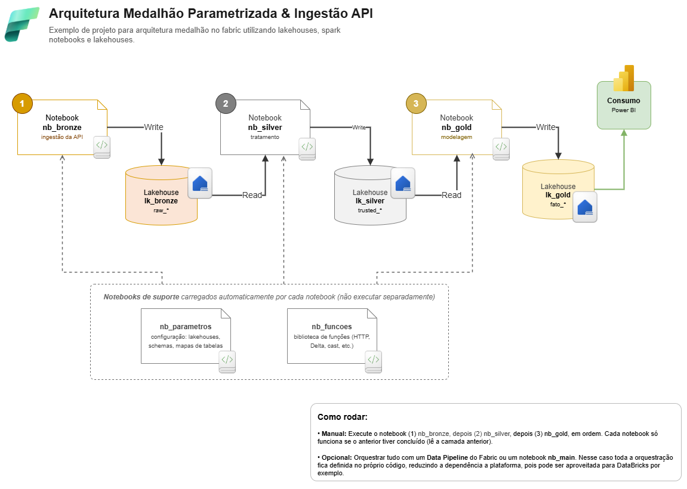

# Pipeline Medallion no Microsoft Fabric

Pipeline de dados com arquitetura Medallion (Bronze → Silver → Gold) implementado no Microsoft Fabric, usando a [PokeAPI](https://pokeapi.co) como fonte de dados.



## Visão geral

Os dados são ingeridos de uma API REST, tratados em camadas progressivas e entregues como tabelas analíticas prontas para consumo em dashboards.

```
PokeAPI → [nb_bronze] → lk_bronze → [nb_silver] → lk_silver → [nb_gold] → lk_gold
```

## Estrutura do workspace

### Notebooks

| Notebook | Função |
|---|---|
| `nb_parametros` | Configuração centralizada: lakehouses, schemas, mapas de tabelas |
| `nb_funcoes` | Biblioteca de funções reutilizáveis (HTTP, Delta, cast, logging) |
| `nb_bronze` | Ingestão da API → tabelas `raw_*` no `lk_bronze` |
| `nb_silver` | Tratamento e tipagem → tabelas `trusted_*` no `lk_silver` |
| `nb_gold` | Modelagem analítica → tabelas `fato_*` no `lk_gold` |
| `nb_main` | Orquestrador: chama Bronze → Silver → Gold em sequência |

### Lakehouses

| Lakehouse | Schema | Conteúdo |
|---|---|---|
| `lk_bronze` | `raw` | Dado bruto da API, particionado por `dt_carga` |
| `lk_silver` | `trusted` | Dado tipado e normalizado |
| `lk_gold` | `fato` | Tabelas analíticas (`fato_pokemon`, `fato_moves_power`) |

## Como executar

**Opção 1 — Manual:** execute os notebooks na ordem abaixo. Cada um depende do anterior.

```
1. nb_bronze
2. nb_silver
3. nb_gold
```

**Opção 2 — nb_main (recomendado):** execute apenas `nb_main`. Ele orquestra os três automaticamente e interrompe a pipeline em caso de falha.

**Opção 3 — Data Pipeline:** crie um pipeline no Fabric com três atividades Notebook (Bronze → Silver → Gold) ligadas por dependência *On success*. Permite agendamento e monitoramento nativo.

## Decisões de arquitetura

- **Data-driven:** adicionar uma tabela nova é editar apenas `nb_parametros`, sem tocar na lógica das camadas.
- **DRY:** toda mecânica repetida (retry HTTP, escrita Delta, cast de schema) vive em `nb_funcoes`.
- **Bronze imutável:** o dado bruto é preservado sem transformação, permitindo reprocessamento sem chamar a API novamente.
- **Resiliência:** erros são acumulados por tabela — uma falha não cancela as demais tabelas do mesmo notebook.
- **Portabilidade:** `mssparkutils` / `notebookutils` é compatível com Databricks; a troca de plataforma não exige reescrita da lógica de negócio.